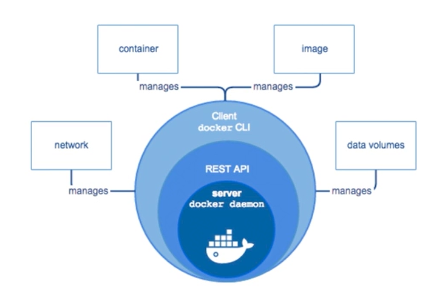

# Docker




CLI  Docker

```bash
sudo docker run hello-world # Hello world in docker
sudo docker run nginx 
sudo docker run -p 80:80 nginx 
sudo usermod -aG docker $USER #allow execute docker comand for current user
```

## Docker images manager

```bash
docker image ls #list images

REPOSITORY   TAG       IMAGE ID       CREATED        SIZE
nginx        latest    f6987c8d6ed5   19 hours ago   141MB

#Tag: show the image version

docker pull python:3 #allow to download an image from a docker registry

docker run <imagen> # run image
```

## Docker logs manager

```bash
docker run -d nginx # run in background, -d, --detach
docker ps # show the container that are running
docker ps -a #show all container,-a --all
docker run -d --name <container-name> <image> #run an image with a custom name
docker logs <container-name> # show container standar output or logs
docker top <container-name> # show running processes inside container
docker exec <container-name> <linux-comand> #run linux comand inside container
#flag -it: interactive mode
docker exec -it <container-name> bash #get into container
docker stop <container-name> #stop container
docker rm <container-name> # Delete container

docker run -d --name mi-nginx -p 90:80 nginx# runing container
docker run -d --rm --name mi-nginx -p 90:80 nginx# --rm delete contaner when this is stoped
```

> `<container-name>` can be replace by `<container-id>`
> 

## Volumes

```bash
#with -v flag, we can specify a directory on the system that Docker can use 
#to repalce a specific directory path
docker run -d --rm --name mi-nginx -p 90:80 -v <path>:<container-path> nginx
docker volume ls # list all volumes
docker volume create <vol-name>#create volume
#mounting volume on contaner
docker run -d --rm --name mi-nginx --mount source=v-web,target=/usr/share/nginx/html nginx
docker volume rm <vol-name>
```

## Redes

- Bridge

```bash
create a virtual network
```

- Host
- Overlay #comunicacion dos dockers daemon
- MacvLan
- None

```bash
docker network ls # ls,list
docker network inspect <red-name>

install iproute2 #install ip comand
apt install iputils-ping # install ping

docker network create -d <driver> <red-name># driver bridge, host,overlay,macvlan,none
#with --net flag we can indicate the network
docker run -d -rm --net=<red-name>--name mi-nginxh nginx

#add a container to the network, if the conainer already on another network
#it will not be desconnected
docker network connect <red-name> <container-name>
```

```bash
#nota
docker network disconnect bridge mi-nginx
docker network disconnect bridge mi-nginx2
docker network create -d bridge mired
docker network connect mired mi-nginx
docker network connect mired mi-nginx2
docker network connect mired mi-nginxh
docker network inspect mired
```

## Image

```docker
#tag == -t
#build a custom image
docker build -t <name-image>:1.0 <path/files>

```

```docker
# images

## imagen base
FROM ubuntu

## execute commands 
RUN apt update
RUN apt install python3 python3-dev -y
RUN mkdir /app

## Define my work directory
WORKDIR /app
ADD index.html /app/
##
# COPY index.html /app/

## run when container is starting
CMD python3 -m http.server 5000

EXPOSE 5000
```


## Docker Hub

```docker
## public an image in docker hub
docker login #login
docker tag <image-name>:<vesion> <hub-username>/<hub-image-name>:<vesion>
docker push <hub-username>/<hub-image-name>:<version>
## https://hub.docker.com/
```

## Docker Compose

- install

`sudo pip install docker-compose`

```docker
docker-compose up #execute the docker-compose.yml
docker-compose up -d #
docker-compose run <service-name> bash
docker-compose down # Stop all service and delete dependencies
docker-compose up -d --build #star service and rebuild docker image
### VOLUMENS

```